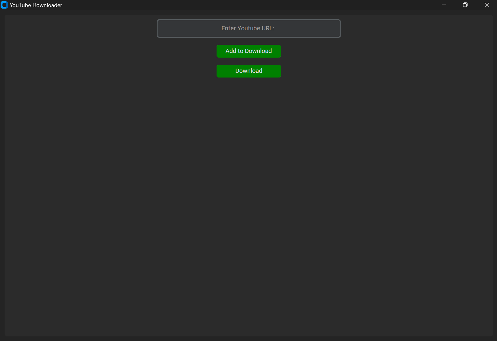
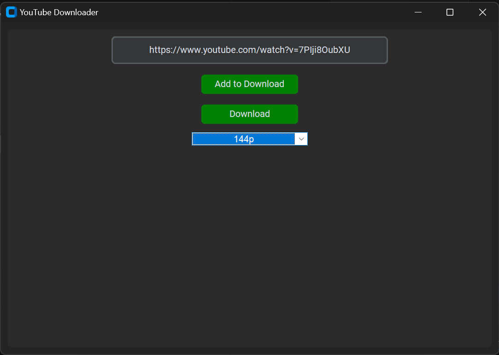

# YouTube Downloader




> A simple YouTube downloader application built with Python and Tkinter.

---

## Table of Contents

- [Description](#description)
- [Features](#features)
- [Installation](#installation)
- [Usage](#usage)
- [Contributing](#contributing)
- [License](#license)
- [Contact](#contact)

---

## Description

YouTube Downloader is a desktop application that allows users to easily download videos from YouTube. It provides a user-friendly interface built with Tkinter and utilizes the pytube library to fetch video information and download streams.

---

## Features

- Download videos from YouTube in various resolutions.
- Supports downloading entire playlists.
- Progress tracking during downloads.
- Dark mode theme for comfortable viewing.
- Cross-platform compatibility (Windows, macOS, Linux).

---

## Installation

1. Clone the repository:

    ```bash
    git clone https://github.com/your-username/youtube-downloader.git
    ```

2. Install dependencies:

    ```bash
    pip install -r requirements.txt
    ```

---

## Usage

1. Run the application:

    ```bash
    python youtube_downloader.py
    ```

2. Enter the YouTube video URL in the provided input box.

3. Click on "Add to Download" to fetch available resolutions.

4. Select the desired resolution from the dropdown menu.

5. Click on "Download" to start downloading the video.

---

## Contributing

Contributions are welcome! If you'd like to contribute to this project, please follow these steps:

1. Fork the repository.
2. Create a new branch (`git checkout -b feature/improvement`).
3. Make your changes.
4. Commit your changes (`git commit -am 'Add new feature'`).
5. Push to the branch (`git push origin feature/improvement`).
6. Create a new Pull Request.

---

## License

This project is licensed under the MIT License - see the [LICENSE](LICENSE) file for details.

---

## Contact

If you have any questions, suggestions, or issues regarding the project, feel free to reach out:

- Email: your-email@example.com
- GitHub: [your-username](https://github.com/your-username)

---
